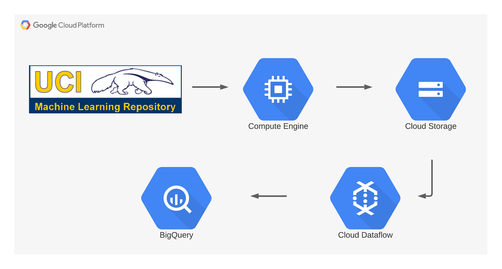

# Big Data Pipelines with Apache Beam using Google Cloud DataFlow and Google BigQuery

| | |
|-|-|
|__Title__| Pipeline to Ingest Big Data to BigQuery with Apache Beam on Google Cloud DataFlow: Using the Physical Activity Monitoring Dataset from Kaggle
|__Presenter__ | __Karis Bisong__  Cloud Data Engineer 
|__Website__ | <a href="https://karisb.ca/apache-beam-big-data/">https://karisb.ca/apache-beam-big-data/</a>

# Contents:
- [Create a bucket on GCS](https://github.com/KarisBisong/gcp_beam_pipeline_pamap2/blob/master/beam_pipeline_dataflow.ipynb)
- [Ephemeral GCE instance for data staging](https://github.com/KarisBisong/gcp_beam_pipeline_pamap2/blob/master/beam_pipeline_dataflow.ipynb)
- [Download from data source to ephemeral GCE](https://github.com/KarisBisong/gcp_beam_pipeline_pamap2/blob/master/beam_pipeline_dataflow.ipynb)
- [Transfer data from transient GCE to Google Cloud Storage (GCS)](https://github.com/KarisBisong/gcp_beam_pipeline_pamap2/blob/master/beam_pipeline_dataflow.ipynb)
- [Exploratory Data Analysis](https://github.com/KarisBisong/gcp_beam_pipeline_pamap2/blob/master/beam_pipeline_dataflow.ipynb)
- [Create BigQuery Dataset](https://github.com/KarisBisong/gcp_beam_pipeline_pamap2/blob/master/beam_pipeline_dataflow.ipynb)
- [Big Data Pipeline with Apache Beam](https://github.com/KarisBisong/gcp_beam_pipeline_pamap2/blob/master/beam_pipeline_dataflow.ipynb)

This project migrates the datasets from Google Cloud Storage (GCS) to BigQuery. The original datasets on https://archive.ics.uci.edu/ml/datasets/pamap2+physical+activity+monitoring contains 1 data file per subject per session (protocol or optional). The session `Protocol` contains 9 data files, while `Optional` has 5 data files. The goal of the pipeline is to merge all the data files into their respective sessions as a table in BigQuery.

The output on BigQuery contains 2 tables (`Prorocol` and `Optional`), with their associated data.

